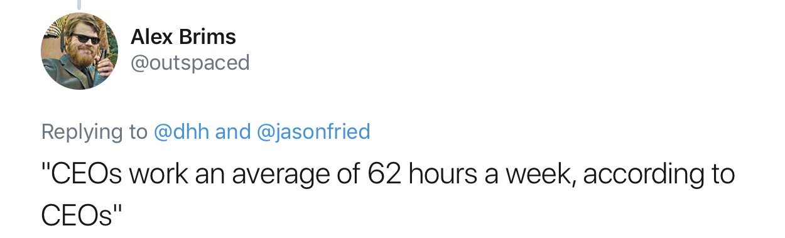

# 3 Things You Might Get by Tracking Time

I started tracking time several years ago. It was new and exciting in the beginning. After a little while I found it boring and exhaustive.  
Eventually it became a habit.

When I started, I didn't know what to track and how to do it. Should I log time only for projects at work or for anything? Should I track how much time I spend watching TV?

I didn't have this answers. Most importantly, I dind't have any goals neither –– I just wanted to try some kind of [lifelogging](https://en.wikipedia.org/wiki/Quantified_self) because the concept itself was very interesting at that time.  

You can't be disappointed if you don't have any expectations, so I was positively surprised by the results I was able to achieve:

- [Less context switching](#less-context-switching)
- [Realistic picture of effort](#realistic-picture-of-effort)
- [Better estimation](#better-estimation)

## Less context switching
When I say "time tracking", I mean "manual time tracking".  
I open an app on my computer or smartphone, fill a couple of fields about what I'm doing and press "Start". Or I just select something from the history if I did it in the past.  

Nobody complained but I suppose that sometimes it can be annoying for people around me.  
Imagine the situation: I work on something on the laptop and a colleague comes with a question
> Colleague: Hi, do you have a couple of minutes?  
> Me: \<picks the phone>  
> Me: \<opens an app, does several taps>  
> Me: \<puts the phone in place>  
> Me: Sure, what's up?

Luckely they know that I'm not just checking my Instagram feed –– but it may look a bit weird. Just a bit.  

The reasoning behind this strange movements is that I want to have accurate statistics. More or less. When someone asks me for a couple of minutes, it never takes 2 minutes. It seems obvious that I should stop my current timer –– otherwise data would be incorrect.  

*Well, you say, but what's about online communications? If you track when somebody distracts you offline, shouldn't you do the same when you get a new message?* 

Of course I should and I do! When something online requires me to stop doing my current task and switch my attention, I log it as well.

> **And this is the key point –– I deliberately add extra overhead for context switch.** 

It is normal for people to avoid extra work, right? The solution is simple: if I need to do all this extra work when I switch my attention, I unintentionally try to minimize context switch. 

It's like procrastination back to front. When you have a hard task to do, your brain want to switch to something simple.  
The concept is the same: it's harder to switch to the new thing because you need to track time. Therefore it's easier to just continue your current task.

You don't look for distractions, you avoid it.

## Realistic picture of effort

I had this feeling many times in my life: I try hard but nothing changes.  

* I work on my project but it never becomes new Facebook. Actually, it never even goes public.  
* I try to grow as a professional but I still don’t feel like I’m ready to apply for this position.  
* I work 12 hours a day but don’t get a promotion (my favourite)  

Whenever I hear it, I advise to track time to get the real picture.  

Usually it's properly described by this tweet: 

but it's less funny.  
[Data in this research](https://www.bls.gov/opub/mlr/2011/06/art3full.pdf) illustrate that people overestimate their work hours by 5–10 percent and the more hours they say, the bigger the gap is:

And this is only about "working hours" –– how much time was spend on work. We come to the office every workday at the same time (more or less) and still give the wrong answer.  
Imagine how it goes if we should answer about "productive hours" or our own projects, where we don't have any schedule and guides:
* I feel like I learn Spanish but the data says that I spent on it only 2 hours last month  
* I feel like I’m exhausted working on my project but in reality I have been programming for only 30 minutes. And then I spent 3 hours reading articles about Elon Musk. Despite the fact that my brain considers it somehow related, it probably doesn’t help my project moving forward. 

If you feel that you work hard but something is unfairly bad, try to get the realistic picture of effort

## Better estimation

This part is a bit different from the previous two.  

You track time –– you get less context switch.  
You track time –– you get a picture of your effort.

But it doesn't work like this with estimation. It's sad to admit but to be better in estimation you should **not only track time but also analyze data**. 

Good estimation requires us to solve 2 problems:  
1. Estimate how much time a task can take  
2. Estimate when we finish

Yes, this problems are different. If I need 8 hours to finish this task it doesn't mean that it'll be finished tomorrow. But first things first.

To estimate a task, I usually:  
1. Decompose it to small tasks  
2. Go through all the sub-tasks and try to remember if I did something similar in the past.   
   If I did, I roughly know how much time it took for me to finish (because I tracked it).  
   If I didn't have anything like this, I try to guess. 

Then, after I finish the task, I look at my log and my estimation to get more information for the future. Next time I have something similar, my estimation will be more accurate.  

This approach helps to eliminate common problems:  
* 15-minutes task
* Hidden bottleneck

Time tracking can help us to **estimate how much time a task can take** if our tasks are similar in some extent. If we did in the past, we can look back and use the same number as the initial estimation. Then we can adjust this number if necessary.  
